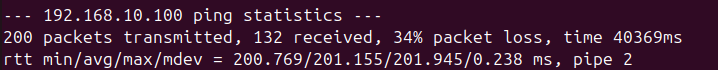
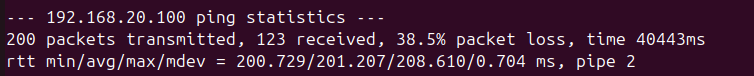
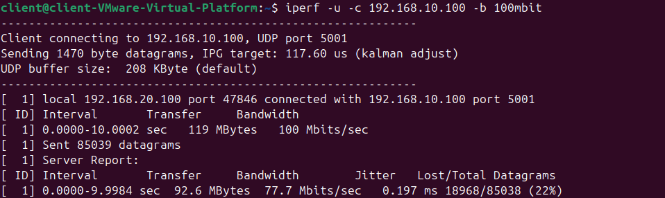
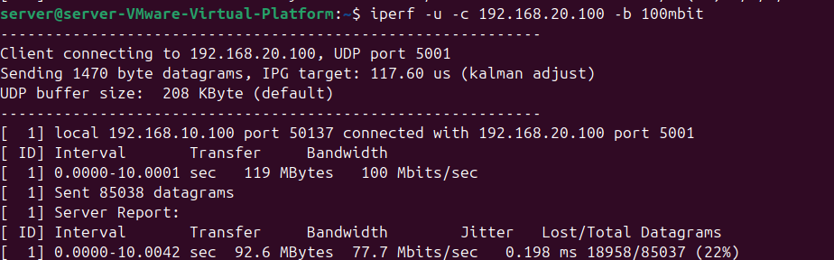
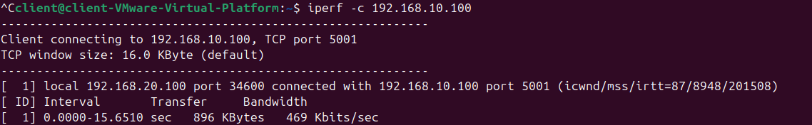
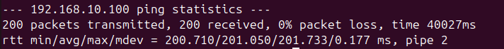
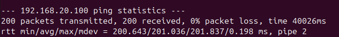
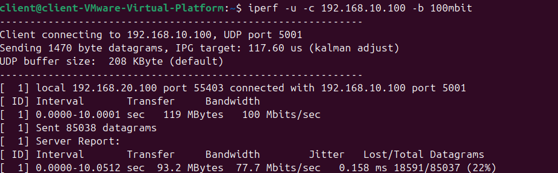
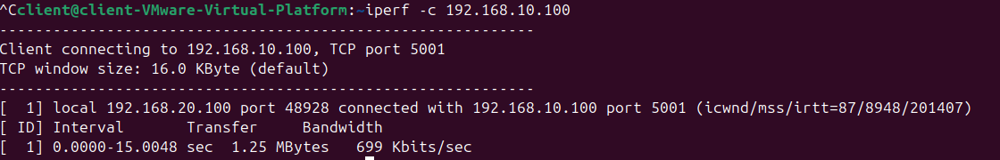

# EE 542 Lab 2 – Fast, Reliable File Transfer

## Part 1: Simulating Networking Environments

### Case 1 The round-trip time (RTT) of 10ms with the Loss rate of 1% (bi-directional) on a network configured to transfer at 100Mbits/sec for the server, client, and router. (Tests conducted by Junyu Zhao)

#### Summary

### Case 1 — RTT 10 ms, 1% Bi-directional Packet Loss, 100 Mbit/s

| MTU | Test | Direction | Average RTT | Throughput / Bandwidth | Packet Loss / Retransmissions |
|---:|---|---|---:|---:|---:|
| 1500 | Ping | Client → Server | 11.774 ms | — | 2.5% round-trip |
| 1500 | Ping | Server → Client | 11.887 ms | — | 2.0% round-trip |
| 1500 | UDP iperf | Client → Server | — | Verified in test video | ~1% configured per direction |
| 1500 | UDP iperf | Server → Client | — | Verified in test video | ~1% configured per direction |
| 1500 | TCP iperf | Client → Server | — | 23.8 Mbit/s receiver | 150 retransmissions |
| 9000 | Ping | Client → Server | 12.061 ms | — | 3.0% round-trip |
| 9000 | Ping | Server → Client | 11.779 ms | — | 2.0% round-trip |
| 9000 | UDP iperf | Client → Server | — | 98.6 Mbit/s receiver | 1.3% |
| 9000 | UDP iperf | Server → Client | — | 98.3 Mbit/s receiver | 1.5% |
| 9000 | TCP iperf | Client → Server | — | 83.2 Mbit/s receiver | 125 retransmissions |

#### Observation

The Case 1 environment was configured for a **100 Mbit/s bandwidth limit**, approximately **10 ms RTT**, and **1% packet loss in each direction**.

Before applying delay and packet loss, the 100 Mbit/s rate limit was verified using TCP iperf. The measured throughput was approximately **96.0 Mbit/s on the sender** and **95.6 Mbit/s on the receiver**, with **0 retransmissions**.

After applying the complete Case 1 conditions, TCP throughput decreased to approximately **24.2 Mbit/s on the sender** and **23.8 Mbit/s on the receiver**, with **150 retransmissions**.

The measured RTT was approximately **11.8 ms in both directions**, which is close to the target 10 ms RTT considering the baseline delay of the VMware virtual network.

The observed ping packet loss was around **2%–2.5% round-trip**. Since **1% packet loss was configured independently on both VyOS egress directions**, the round-trip ping loss can be close to 2%.

#### Configuration Adjustment

The original lab document used the following TBF parameters:

```text
rate 100mbit latency 0.001ms burst 9015
```

In my VMware environment, this configuration only produced approximately 50–60 Mbit/s TCP throughput and resulted in a large number of retransmissions.


To maintain the required 100 Mbit/s rate while improving stability in the virtual-machine environment, the TBF parameters were adjusted to:

```text
rate 100mbit latency 1ms burst 90155
```

The adjusted parameters were applied to:

- Client egress interface
- Server egress interface
- VyOS interface toward the Client
- VyOS interface toward the Server

After the adjustment, TCP throughput stabilized at approximately 95–96 Mbit/s, with 0 retransmissions.


The required bandwidth rate remained fixed at 100 Mbit/s. Only the TBF queue parameters (latency and burst) were adjusted to better match the VMware environment.

### Case 2: RTT 200 ms, Packet Loss 20% per Direction

**Configuration:** RTT = 200 ms, packet loss = 20% per direction, network rate = 100 Mbit/s.

#### MTU 1500 Results

##### Ping: Client → Server


##### Ping: Server → Client


##### UDP iperf: Client → Server


##### UDP iperf: Server → Client


##### TCP iperf: Client → Server


#### MTU 9000 Results

##### Ping: Client → Server



##### Ping: Server → Client



##### UDP iperf: Client → Server



##### UDP iperf: Server → Client



##### TCP iperf: Client → Server



#### Summary

| MTU | Test | Direction | Average RTT | Throughput | Packet Loss |
|---:|---|---|---:|---:|---:|
| 1500 | Ping | Client → Server | 201.375 ms | — | 37.0% |
| 1500 | Ping | Server → Client | 201.418 ms | — | 35.5% |
| 1500 | UDP iperf | Client → Server | — | 77.6 Mbit/s | 22% |
| 1500 | UDP iperf | Server → Client | — | 77.8 Mbit/s | 22% |
| 1500 | TCP iperf | Client → Server | — | 95.9 Kbit/s | — |
| 9000 | Ping | Client → Server | 201.155 ms | — | 34% |
| 9000 | Ping | Server → Client | 201.207 ms | — | 38.5% |
| 9000 | UDP iperf | Client → Server | — | 77.7 Mbit/s | 22% |
| 9000 | UDP iperf | Server → Client | — | 77.7 Mbit/s | 22% |
| 9000 | TCP iperf | Client → Server | — | 469 Kbit/s | — |

#### Observations

- The measured RTT (~**201 ms**) and round-trip loss (**34.0%–38.5%**) were consistent with the configured 200 ms RTT and 20% per-direction loss. The theoretical round-trip loss is `1 - (1 - 0.20)^2 = 36%`.
- UDP remained stable at about **77.7 Mbit/s** regardless of MTU.
- High RTT and loss severely limited TCP; MTU 9000 improved throughput from **95.9 to 469 Kbit/s**, but it remained far below the link rate.

### Case 3: RTT 200 ms, Packet Loss 0%, Router Limited to 80 Mbit/s

**Configuration:** RTT = 200 ms, no configured random packet loss, client/server rate = 100 Mbit/s, and router rate = 80 Mbit/s.


#### MTU 1500 Results

##### Ping: Client → Server


##### Ping: Server → Client


##### UDP iperf: Client → Server


##### UDP iperf: Server → Client


##### TCP iperf: Client → Server


##### TCP iperf: Server → Client


#### MTU 9000 Results

##### Ping: Client → Server



##### Ping: Server → Client



##### UDP iperf: Client → Server



##### UDP iperf: Server → Client


##### TCP iperf: Client → Server



##### TCP iperf: Server → Client


#### Summary

| MTU | Test | Direction | Average RTT | Throughput | Packet Loss |
|---:|---|---|---:|---:|---:|
| 1500 | Ping | Client → Server | 224.361 ms | — | 0% |
| 1500 | Ping | Server → Client | 224.139 ms | — | 0% |
| 1500 | UDP iperf | Client → Server | — | 70.5 Mbit/s | 28% |
| 1500 | UDP iperf | Server → Client | — | 71.7 Mbit/s | 28% |
| 1500 | TCP iperf | Client → Server | — | 41.6 Mbit/s (receiver) | — |
| 1500 | TCP iperf | Server → Client | — | 56.5 Mbit/s (receiver) | — |
| 9000 | Ping | Client → Server | 201.050 ms | — | 0% |
| 9000 | Ping | Server → Client | 201.036 ms | — | 0% |
| 9000 | UDP iperf | Client → Server | — | 77.7 Mbit/s | 22% |
| 9000 | UDP iperf | Server → Client | — | 77.8 Mbit/s | 22% |
| 9000 | TCP iperf | Client → Server | — | 699 Kbit/s | — |
| 9000 | TCP iperf | Server → Client | — | 711 Kbit/s | — |

#### Observations

- Sending UDP at 100 Mbit/s through the 80 Mbit/s router bottleneck caused **22%–28% congestion loss**, despite zero configured random loss; received throughput was **70.5–77.8 Mbit/s**.
- At MTU 1500, Client → Server TCP throughput was **41.6 Mbit/s**, approximately **434×** Case 2's **95.9 Kbit/s**.
- At MTU 9000, TCP reached **699 Kbit/s** Client → Server and **711 Kbit/s** Server → Client. The 16.0 KByte TCP window limits throughput at ~201 ms RTT to about `16 KBytes × 8 / 0.201 s ≈ 0.65 Mbit/s`, close to the measurements; the low rates therefore cannot be attributed to MTU alone.
- MTU 1500 ping RTT (~**224 ms**) exceeded both the 200 ms target and the MTU 9000 result (~**201 ms**), indicating extra queueing or run-to-run variation.

#### Critical Thinking

Case 2 and Case 3 have similar RTTs (~200 ms) and UDP throughput (~78 Mbit/s), but Case 2's 20% random loss repeatedly reduces the TCP congestion window; the high RTT further slows ACKs and loss recovery. Without random loss, Case 3 can sustain much higher MTU 1500 TCP throughput, while its UDP loss results from the 80 Mbit/s bottleneck rather than the configured network conditions.

The MTU 9000 TCP tests were instead limited by their 16 KB TCP window (~0.65 Mbit/s at 200 ms RTT). Because the MTU 1500 and MTU 9000 tests used different window conditions, MTU effects cannot be compared reliably without retesting with the same iperf version, TCP window, and duration.


## Part 2: Fast and Reliable File Transfer
## Protocol Design and Implementation

This project implements a reliable file transfer protocol on top of UDP.

UDP provides low-overhead datagram delivery, but it does not guarantee packet delivery, ordering, duplicate suppression, or retransmission. To provide reliable file transfer, the protocol adds its own control and recovery mechanisms at the application layer.

### Overall Transfer Flow

The transfer is divided into three stages:

1. **Connection Setup**
   - The sender first sends a `META` packet containing the file size, payload size, and total number of data packets.
   - The receiver responds with `META_ACK`.
   - If the acknowledgement is lost, the sender retransmits the `META` packet.

2. **Reliable Data Transfer**
   - The sender divides the file into sequence-numbered `DATA` packets.
   - Multiple packets can be transmitted within a sliding window without waiting for each individual acknowledgement.
   - Each valid `DATA` packet is acknowledged by the receiver using an `ACK` containing the corresponding sequence number.
   - Packets that are not acknowledged before the retransmission timeout are selectively retransmitted.
   - Sender-side pacing is used to control the packet injection rate and reduce burst-related packet drops.

3. **Transfer Termination**
   - After all data packets have been acknowledged, the sender transmits a `FIN` packet.
   - The receiver accepts the `FIN` only after all data packets have been received in sequence.
   - The receiver replies with `FIN_ACK` to complete the transfer.
   - The receiver remains active briefly after completion so that it can respond again if the original `FIN_ACK` is lost.

### Packet Structure

Each protocol packet contains a common header:

- `protocol_id` — identifies packets belonging to this protocol
- `seq` — sequence number used for ordering, acknowledgement, duplicate detection, and retransmission
- `length` — size of the current payload
- `type` — identifies the packet as `META`, `DATA`, `ACK`, `FIN`, etc.

The protocol defines the following packet types:

- `META`
- `META_ACK`
- `DATA`
- `ACK`
- `FIN`
- `FIN_ACK`

### Sender Design

The sender is responsible for:

- Reading the input file
- Splitting it into fixed-size payloads
- Assigning sequence numbers to each packet
- Maintaining a sliding window of unacknowledged packets
- Processing incoming ACKs
- Detecting retransmission timeouts
- Selectively retransmitting only missing packets
- Applying packet pacing
- Reporting transfer time, throughput, and retransmission statistics

Unacknowledged packets are stored using their sequence number together with the packet data and send timestamp. When an ACK arrives, the corresponding packet is removed from the outstanding set.

This design allows multiple packets to remain in flight and avoids the performance limitation of Stop-and-Wait transmission, especially under high RTT.

### Receiver Design

The receiver is responsible for:

- Receiving and validating protocol packets
- Processing transfer metadata
- Sending acknowledgements
- Detecting duplicate packets
- Buffering packets that arrive out of order
- Delivering data to the output file in the correct sequence
- Handling reliable transfer termination

The receiver maintains an `expected_seq` value representing the next packet that can be delivered in order.

If packets arrive ahead of `expected_seq`, they are temporarily stored in an out-of-order buffer. Once the missing packet arrives, all newly consecutive packets can be processed in sequence.

Duplicate packets are not written twice, but they are acknowledged again because the previous ACK may have been lost.

### Sliding Window and Selective Retransmission

The protocol uses a sliding-window design so that multiple packets can be transmitted before their ACKs return.

This is particularly important in high-latency environments because a Stop-and-Wait design would leave the link idle while waiting for acknowledgements.

Only packets that remain unacknowledged beyond the retransmission timeout are retransmitted. This selective retransmission approach avoids unnecessarily resending packets that have already been successfully received.

### Sender Pacing

A large sliding window alone does not control how quickly packets are injected into the network.

Without pacing, UDP can generate a large burst of packets in a very short period of time, which may overflow the configured network queue and cause additional packet loss.

The sender therefore spaces packet transmissions according to a configurable pacing rate. This helps keep the sending rate closer to the available network bandwidth and reduces burst-related retransmissions.

### Out-of-Order Handling

Because UDP does not guarantee packet ordering, packets may arrive in a different order from the order in which they were sent.

The receiver therefore buffers packets using their sequence numbers.

For example:

Sent:     0 1 2 3 4
Received: 0 1 3 4 2

### Multithreading Improvements

The sender was improved with a dedicated ACK receiver thread, allowing ACKs to be processed while the main thread continues paced transmission and retransmission. This releases sliding-window space more quickly and reduces pauses between sending and ACK processing. The receiver now uses a separate file-writer thread and a thread-safe queue, so disk I/O does not block packet reception or ACK generation. Mutexes and condition variables synchronize shared state and avoid unnecessary busy waiting. These changes improve pipeline utilization and are especially useful on high-RTT links.

### Results

| Case | MTU | Pacing Rate | Time (s) | Goodput (Mbps) | Retransmissions | MD5 Match |
|---|---:|---:|---:|---:|---:|:---:|
| Case 1 | 1500 | 95 Mbps | 97.539 | 88.066 | 21,123 | Yes |
| Case 1 | 9001 | 95 Mbps | 94.692 | 90.714 | 3,644 | Yes |
| Case 2 | 1500 | 95 Mbps | 170.754 | 50.306 | 435,200 | Yes |
| Case 2 | 9001 | 95 Mbps | 158.518 | 54.189 | 85,230 | Yes |
| Case 3 | 1500 | 75 Mbps | 115.597 | 74.309 | 5 | Yes |
| Case 3 | 9001 | 75 Mbps | 111.600 | 76.971 | 0 | Yes |
