# EE 542 Lab 2 – Fast, Reliable File Transfer

## Part 1: Simulating Networking Environments
## Case 1 The round-trip time (RTT) of 10ms with the Loss rate of 1% (bi-directional) on a network configured to transfer at 100Mbits/sec for the server, client, and router. (Tests conducted by Junyu Zhao)

### Summary

| Test | Direction | Average RTT | Throughput / Bandwidth | Packet Loss |
|---|---|---:|---:|---:|
| Ping | Client → Server | 11.774 ms | - | 2.5% round-trip |
| Ping | Server → Client | 11.887 ms | - | 2.0% round-trip |
| UDP iperf | Client → Server | - | Verified in test video | ~1% configured per direction |
| UDP iperf | Server → Client | - | Verified in test video | ~1% configured per direction |
| TCP iperf | Client → Server | - | 23.8 Mbits/sec receiver | 150 retransmissions |

### Observation

The Case 1 environment was configured for a **100 Mbit/s bandwidth limit**, approximately **10 ms RTT**, and **1% packet loss in each direction**.

Before applying delay and packet loss, the 100 Mbit/s rate limit was verified using TCP iperf. The measured throughput was approximately **96.0 Mbit/s on the sender** and **95.6 Mbit/s on the receiver**, with **0 retransmissions**.

After applying the complete Case 1 conditions, TCP throughput decreased to approximately **24.2 Mbit/s on the sender** and **23.8 Mbit/s on the receiver**, with **150 retransmissions**.

The measured RTT was approximately **11.8 ms in both directions**, which is close to the target 10 ms RTT considering the baseline delay of the VMware virtual network.

The observed ping packet loss was around **2%–2.5% round-trip**. Since **1% packet loss was configured independently on both VyOS egress directions**, the round-trip ping loss can be close to 2%.

### Configuration Adjustment

The original lab document used the following TBF parameters:
rate 100mbit latency 0.001ms burst 9015

In my VMware environment, this configuration only produced approximately 50–60 Mbit/s TCP throughput and resulted in a large number of retransmissions.

To maintain the required 100 Mbit/s rate while improving stability in the virtual-machine environment, the TBF parameters were adjusted to:

rate 100mbit latency 1ms burst 90155

The adjusted parameters were applied to:

Client egress interface
Server egress interface
VyOS interface toward the Client
VyOS interface toward the Server

After the adjustment, TCP throughput stabilized at approximately 95–96 Mbit/s, with 0 retransmissions.

The required bandwidth rate remained fixed at 100 Mbit/s. Only the TBF queue parameters (latency and burst) were adjusted to better match the VMware environment.

### Case 2: RTT 200 ms, Packet Loss 20%

**Configuration:** RTT = 200 ms, packet loss = 20%, network rate = 100 Mbps.

#### Results

##### Ping: Client → Server

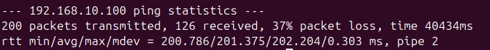

##### Ping: Server → Client

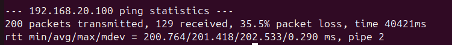

##### UDP iperf: Client → Server

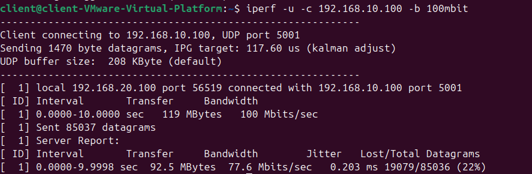

##### UDP iperf: Server → Client

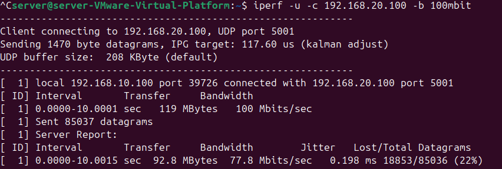

##### TCP iperf: Client → Server

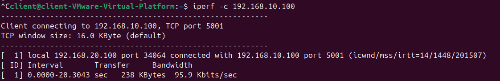

#### Summary

| Test | Direction | Average RTT | Throughput / Bandwidth | Packet Loss |
|---|---|---:|---:|---:|
| Ping | Client → Server | 201.375 ms | - | 37% |
| Ping | Server → Client | 201.418 ms | - | 35.5% |
| UDP iperf | Client → Server | - | 77.6 Mbits/sec | 22% |
| UDP iperf | Server → Client | - | 77.8 Mbits/sec | 22% |
| TCP iperf | Client → Server | - | 95.9 Kbits/sec | - |

#### Observation

UDP throughput remained around 78 Mbps, while TCP throughput dropped significantly under high RTT and packet loss.

### Case 3: RTT 200 ms, Packet Loss 0%, Router Limited to 80 Mbps

#### Results

##### Ping: Client → Server

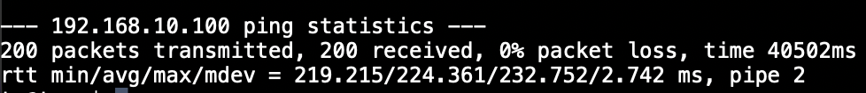

##### Ping: Server → Client

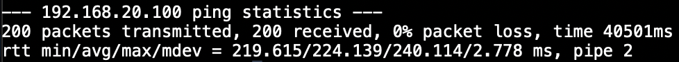

##### UDP iperf: Client → Server

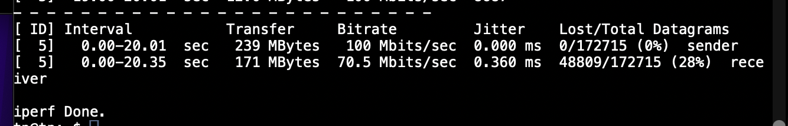

##### UDP iperf: Server → Client

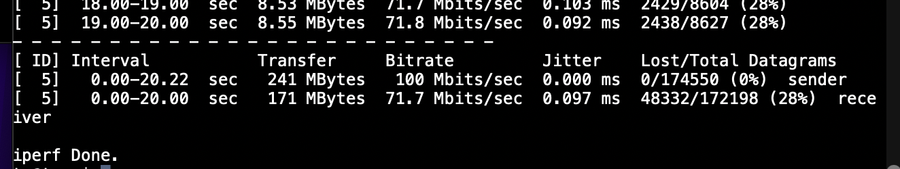

##### TCP iperf: Client → Server

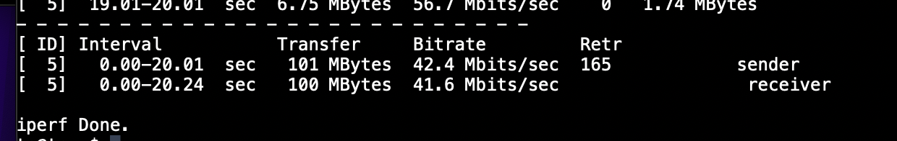

##### TCP iperf: Server → Client

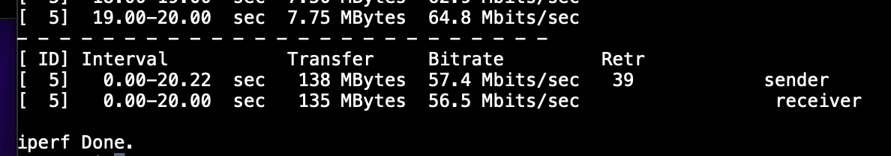

#### Summary

| Test | Direction | Average RTT | Throughput / Bandwidth | Packet Loss |
|---|---|---:|---:|---:|
| Ping | Client → Server | 224.361 ms | - | 0% |
| Ping | Server → Client | 224.139 ms | - | 0% |
| UDP iperf | Client → Server | - | 70.5 Mbits/sec | 28% |
| UDP iperf | Server → Client | - | 71.7 Mbits/sec | 28% |
| TCP iperf | Client → Server | - | 41.6 Mbits/sec receiver | - |
| TCP iperf | Server → Client | - | 56.5 Mbits/sec receiver | - |

